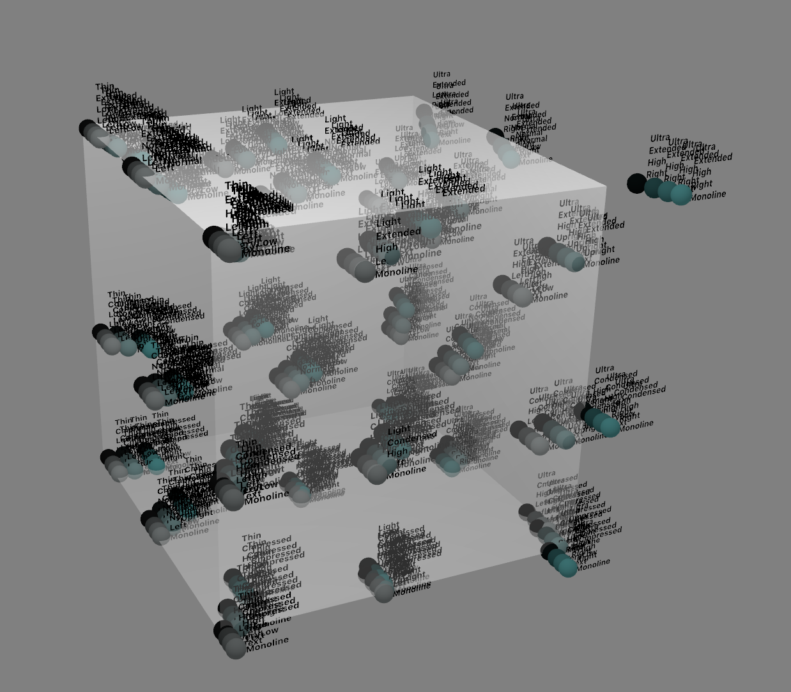

#  Instances Calculator

Instances Calculator is a set of two apps for macOS:

1. A commandline tool `calculate_instances`
2. A GUI app `ShowMeInstances`

The apps are tools that can help designers of variable OpenType fonts or of multi-axis font families distort the design space and then calculate the instance locations.

The tools are a bit experimental.

### If you know what MultipleMaster or Variable Font is, it will be much easier to understand what this software does.

If you design or developing font in MM or VariableFont technology, sometimes happened that particular Masters does not fit to each other — i.e. BlackCondensed could be to wide to pair with ThinCondensed or BlackCondesed could have different ”blackness” than BlackExtended.

There are two ways to deal with problem: to redesign masters or set their coordiantes in nice-looking places.

But in this second approach setting coordinates for particular styles are became a bit harder: there are not anymore [Light, Extended] coordinates but [LightSlightlyChangedOnWidthAxis, ExtendedSlghtlyChangedOnWeightAxis].

## Let's try an example

Two dimensional font has four masters: ThinCondensed, BlackCondensed, ThinExtended and BlackExtended.
Let's say that generated instance ThinCondensed sholud be wider, BlackCondensed a little bit lighter, ThinExtended darker, and BlackExtedned not so wide and lighter. But what with restof instances? Which coordinates will be for NarrowBold? We need to set values for Narrow style at Width axis, separate for Light and Black edge and values for Weight axis, separate for Condensed and Extended edges. For two dimensions it's easy: it's just a point, where lines cross.


Fore more than two dimensions it bacame a little more complicated. First, each axis has `2^(n-1)` edges, where `n` is equal to number of dimensions. Second, lines in more then two dimensions doesn't like to cross each other. Sometimes they do, but in most cases don't. But it's possible to find common point of each dimension hyperbolic paraboloids. So, this tool does.


## Installation

1. Download and install [Swift 5 Runtime Support for Command Line Tools](https://support.apple.com/kb/DL1998) — you’ll need it to run the `calculate_instances` commandline app.

2. Currently, there are no compiled downloadable versions of Instances Calculator, but they will be published soon. Right now you need the most recent XCode and you need to build the tools yourself.


## Usage

The `ShowMeInstances` GUI app lets you open an **axesmatrix** JSON file, shows it in the left pane, in the middle visualizes it, and in the right pane shows the **instances** JSON. The `calculate_instances` commandline tool takes the axesmatrix JSON file as input, and outputs the instances JSON file.

### Axesmatrix JSON

The axesmatrix file is a JSON file with a syntax very similar to the syntax used in **[FontLab 7](http://fontlab.info)**.

Read the FontLab 7 documentation chapters [Variations](https://help.fontlab.com/fontlab/7/manual/Variable-Fonts/) and [Working with
Font Variations](https://help.fontlab.com/fontlab/7/manual/Working-with-Font-Variations/) to understand design space, axes, axis instances, and instances.

1. Open FontLab 7. (You can download a 30-day fully-functional trial from FontLab’s website).
2. Turn on _Preferences > Editing > Copy FontLab JSON data as plain text_
3. Open your multi-axis font in FontLab.
4. Go to _File > Font Info > Axes_
5. Write your axis instances per axis.
5. Click _Copy Page_ (bottom-left corner)
6. Paste the JSON representation of the axes into a text editor such as Atom or Sublime Text.

In FontLab 7, all axis instances are orthogonal — the same value is used at the min and the max end. So the JSON will look something like this:

```json
{
  "dataType":"com.fontlab.info.axes",
  "axes":[
    {
      "name":"weight",
      "shortName":"wt",
      "tag":"wght",
      "designMinimum":0,
      "designMaximum":1000,
      "minimum":0,
      "maximum":1000,
      "default":450,
      "axisGraph":{
        "0":0,
        "1000":1000
      },
      "axisInstances":[
        {
          "name":"Book",
          "value":250
        },
        {
          "name":"(Regular)",
          "value":450
        },
        {
          "name":"Medium",
          "value":600
        },
        {
          "name":"Bold",
          "value":900
        }
      ]
    },
    {
      "name":"width",
      "shortName":"wd",
      "tag":"wdth",
      "designMinimum":0,
      "designMaximum":1000,
      "minimum":0,
      "maximum":1000,
      "default":400,
      "axisGraph":{
        "0":0,
        "1000":1000
      },
      "axisInstances":[
        {
          "name":"Condensed",
          "value":100
        },
        {
          "name":"Narrow",
          "value":350
        },
        {
          "name":"(Normal)",
          "value":650
        },
        {
          "name":"Wide",
          "value":950
        }
      ]
    }
  ]
}
```

The **axesmatrix** JSON syntax is a subset of the above syntax, but instead of one `value` element, it uses a list of `values`. Each `values` list lists the values of a given axis instance on each “edge” of the design space. (**to be explained**).

__Important__: number of `values` in each `axisInstances` entry must be equal `2^(dimensions - 1)`; 2 for 2-dimensional, 4 for 3-dimensional, 8 for 4-dimensional designspace.

Only first and last values counts (**to be explained**).

There can also be an experimental parameter `distribution`, which causes exponential disribution of styles.

`calculate_instances` and `ShowMeInstances` takes this JSON as input:

```json
{
	"axes":[
		{
			"name":"weight",
			"designMinimum":0,
			"designMaximum":1000,
			"axisInstances":[
				{
				"name":"Book",
				"values": [250, 100]
				},
				{
				"name":"(Regular)",
				"values": [450, 300]
				},
				{
				"name":"Medium",
				"values": [600, 550]
				},
				{
				"name":"Bold",
				"values": [900, 950]
				}
			]

		},
		{
			"name":"width",
			"designMinimum":0,
			"designMaximum":1000,
			"axisInstances":[
				{
				"name":"Condensed",
				"values": [100, 50]
				},
				{
				"name":"Narrow",
				"values": [350, 300]
				},
				{
				"name":"(Normal)",
				"values": [650, 600]
				},
				{
				"name":"Wide",
				"values": [950, 950]
				}
			]
		}
	]
}
```

If you save this JSON as `yourfont.axesmatrix.json`, you can use the command-line:

```
calculate_instances yourfont.axesmatrix.json outfont.instances.json
```

### Instances JSON

You will get back an instances JSON:

```json
{
	"instances": [
		{
			"name": "Book Condensed",
			"tsn": "Book Condensed",
			"location": {
				"width": 88.16120906801008,
				"weight": 236.7758186397985
			}
		},
		{
			"name": "Book Narrow",
			"tsn": "Book Narrow",
			"location": {
				"width": 340.0503778337531,
				"weight": 198.992443324937
			}
		},
		{
			"name": "Book (Normal)",
			"tsn": "Book (Normal)",
			"location": {
				"width": 642.3173803526449,
				"weight": 153.6523929471033
			}
		},
		{
			"name": "Book Wide",
			"tsn": "Book Wide",
			"location": { "width": 950, "weight": 107.5 }
		},
		{
			"name": "(Regular) Condensed",
			"tsn": "(Regular) Condensed",
			"location": {
				"width": 78.08564231738035,
				"weight": 438.2871536523929
			}
		},
		{
			"name": "(Regular) Narrow",
			"tsn": "(Regular) Narrow",
			"location": {
				"width": 329.9748110831234,
				"weight": 400.5037783375314
			}
		},
		{
			"name": "(Regular) (Normal)",
			"tsn": "(Regular) (Normal)",
			"location": {
				"width": 632.2418136020151,
				"weight": 355.1637279596977
			}
		},
		{
			"name": "(Regular) Wide",
			"tsn": "(Regular) Wide",
			"location": { "width": 950, "weight": 307.5 }
		},
		{
			"name": "Medium Condensed",
			"tsn": "Medium Condensed",
			"location": {
				"width": 70.17543859649122,
				"weight": 596.4912280701756
			}
		},
		{
			"name": "Medium Narrow",
			"tsn": "Medium Narrow",
			"location": {
				"width": 320.8020050125313,
				"weight": 583.9598997493734
			}
		},
		{
			"name": "Medium (Normal)",
			"tsn": "Medium (Normal)",
			"location": {
				"width": 621.5538847117795,
				"weight": 568.922305764411
			}
		},
		{
			"name": "Medium Wide",
			"tsn": "Medium Wide",
			"location": { "width": 950, "weight": 552.5 }
		},
		{
			"name": "Bold Condensed",
			"tsn": "Bold Condensed",
			"location": {
				"width": 54.86284289276809,
				"weight": 902.7431421446385
			}
		},
		{
			"name": "Bold Narrow",
			"tsn": "Bold Narrow",
			"location": {
				"width": 304.2394014962594,
				"weight": 915.2119700748131
			}
		},
		{
			"name": "Bold (Normal)",
			"tsn": "Bold (Normal)",
			"location": {
				"width": 603.4912718204489,
				"weight": 930.1745635910223
			}
		},
		{
			"name": "Bold Wide",
			"tsn": "Bold Wide",
			"location": { "width": 950, "weight": 947.5 }
		}
	],
	"dataType": "com.fontlab.info.instances"
}
```

This is almost correct for FontLab 7.

Open the `outfont.instances.json` file in a text editor, replace the axis names `weight` and `width` with the 2-letter codes `wt` and `wd`, and replace the regex ` *\(.*\) ` with nothing. Copy the contents to the clipboard. Then in FontLab 7, go to _Font Info > Instances_ and click the _Paste page_ button (3rd in the bottom-left). This will get the predefined instances into FontLab.

If you prefer UI, use `ShowMeInstances` app which is pretty experimental. But first prepare JSON in some editor. This app allwos you to change numbers, copy and delete parts of code, but has some limitations.

## Visual examples

#### Rendering of distributed, not distorted 2d designspace

#### Rendering of distributed, distorted 2d designspace

#### Rendering of manually set 2d designspace

#### Rendering of distorted 3d designspace

#### Rendering of distorted 4d designspace. 4th dimension is represented by white balls

#### Rendering of distorted 5d designspace. 4th dimension is represented by blue color and 5th dimension is represented brightness

#### Rendering of distorted 6d designspace. 4th dimension is represented by hue,  5th by saturation, 6th by brightness.


## License

Copyright 2019 Łukasz Dziedzic

Permission is hereby granted, free of charge, to any person obtaining a copy of this software and associated documentation files (the "Software"), to deal in the Software without restriction, including without limitation the rights to use, copy, modify, merge, publish, distribute, sublicense, and/or sell copies of the Software, and to permit persons to whom the Software is furnished to do so, subject to the following conditions:

The above copyright notice and this permission notice shall be included in all copies or substantial portions of the Software.

THE SOFTWARE IS PROVIDED "AS IS", WITHOUT WARRANTY OF ANY KIND, EXPRESS OR IMPLIED, INCLUDING BUT NOT LIMITED TO THE WARRANTIES OF MERCHANTABILITY, FITNESS FOR A PARTICULAR PURPOSE AND NONINFRINGEMENT. IN NO EVENT SHALL THE AUTHORS OR COPYRIGHT HOLDERS BE LIABLE FOR ANY CLAIM, DAMAGES OR OTHER LIABILITY, WHETHER IN AN ACTION OF CONTRACT, TORT OR OTHERWISE, ARISING FROM, OUT OF OR IN CONNECTION WITH THE SOFTWARE OR THE USE OR OTHER DEALINGS IN THE SOFTWARE.
