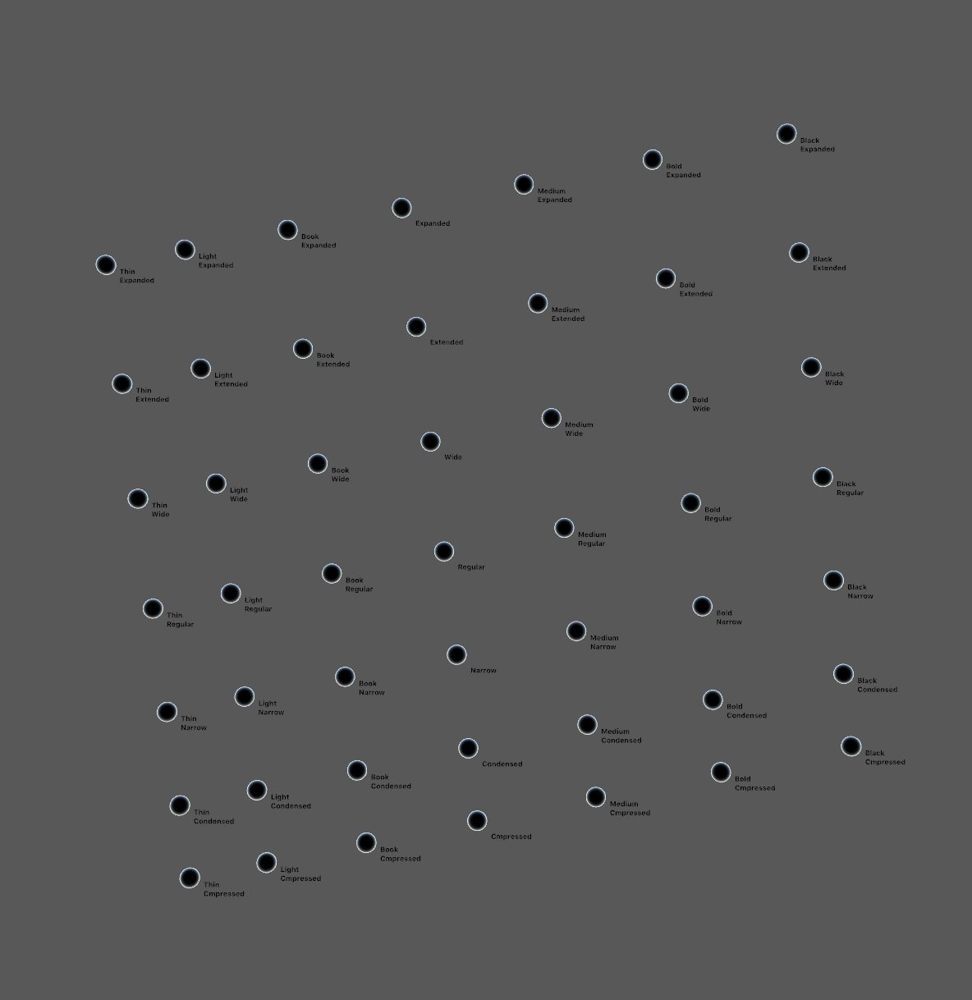
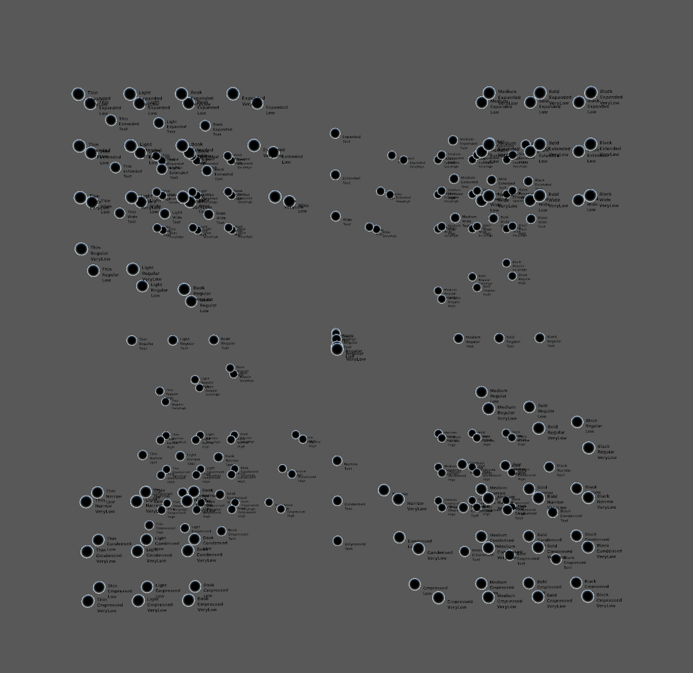
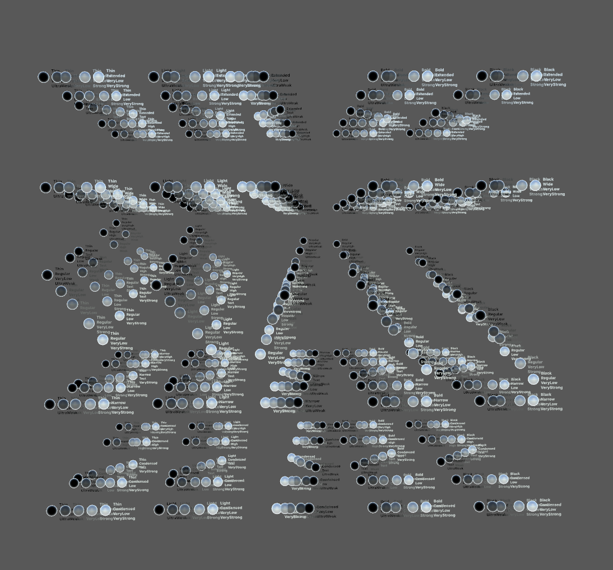
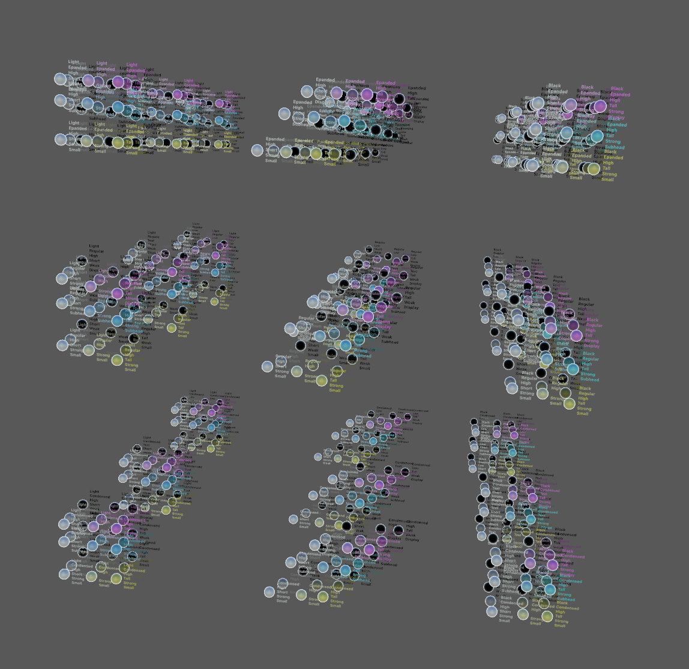

#  Instances Generator: WTF?

OK, here it is. 

### If you know what MultipleMaster or Variable Font is, it will be much easier to understand what this software do.

If you design or developing font in MM or VariableFont technology, sometimes happened that particular Masters does not fit to each other — i.e. BlackCondensed could be to wide to pair with ThinCondensed or BlackCondesed could have different ”blackness” than BlackExtended. 
There are two ways to deal with problem: to redesign masters or set their coordiantes in nice-looking places. 
But in this second approach setting coordinates for particular styles are became a bit harder: there are not anymore [Light, Extended] coordinates but [LightSlightlyChangedOnWidthAxis, ExtendedSlghtlyChangedOnWeightAxis]. 
## Let's try an example
Two dimensional font has four masters: ThinCondensed, BlackCondensed, ThinExtended and BlackExtended.
Let's say that generated instance ThinCondensed sholud be wider, BlackCondensed a little bit lighter, ThinExtended darker, and BlackExtedned not so wide and lighter. But what with restof instances? Which coordinates will be for NarrowBold? We need to set values for Narrow style at Width axis, separate for Light and Black edge and values for Weight axis, separate for Condensed and Extended edges. For two dimensions it's easy: it's just a point, where lines cross.


Fore more than two dimensions it bacame a little more complicated. First, each axis has `2^(n-1)` edges, where `n` is equal to number of dimensions. Second, lines in more then two dimensions doesn't like to cross each other. Sometimes they do, but in most cases don't. But it's possible to find common point of each dimension hyperplane (?) So, this tool does.


## Usage
Input is json file:
```{
	"axes":[
	{
		"name":"wt",
		"designMinimum":0,
		"designMaximum":1000,
		"distribution":1.2,
		"axisInstances":[
		{
			"name":"Thin",
			"values": [80, 0]
		},
		{
			"name":"Light",
			"values": [100, 100]
		},
		{
			"name":"Book",
			"values": [200, 200]
		}
		]
	},
	{
		"name":"wd",
		"designMinimum":0,
		"designMaximum":1000,
		"distribution":1.2,
		"axisInstances":[
		{
			"name":"Compressed",
			"values": [0, 0]
		},
		{
			"name":"Condensed",
			"values": [100, 100]
		},
		{
			"name":"Narrow",
			"values": [200, 200]
		}
		]
	}
	]
}
```
I think it is self-explaing. Except experimental parameter `distribution` which causes exponential disribution of styles. Only first and last values counts.
__Important__: number of values in `axisInstance` must be equal `2^(dimensions - 1)`; 2 for 2-dimensional, 4 for 3-dimensional, 8 for 4-dimensional designspace.
#### Rendering of distributed, not distorted 2d designspace

#### Rendering of distributed, distorted 2d designspace

#### Rendering of distorted 3d designspace

#### Rendering of distorted 4d designspace. 4th dimension is represented by white balls

#### Rendering of distorted 5d designspace. 4th dimension is represented by blue color and 5th dimension is represented brightness

#### Rendering of distorted 6d designspace. 4th dimension is represented by hue,  5th by saturation, 6th by brightness.



